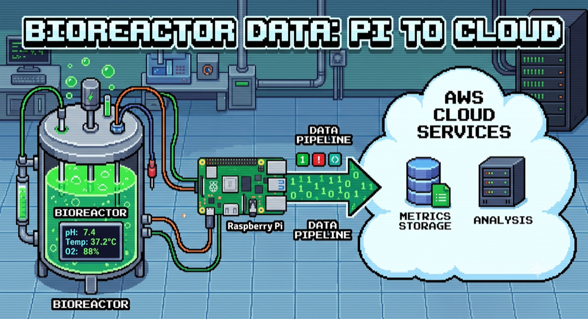

# FermentoCloud



Ship bioreactor temperature readings from a Raspberry Pi to the AWS cloud —
reliably, even when the network drops.

## Mission

A DS18B20 probe on a Raspberry Pi samples the fermentation temperature and a
small collector uploads each reading to an IAM-authenticated Lambda Function
URL, which stores it in DynamoDB. Readings are buffered locally in SQLite when
the network is down and flushed on reconnect, so no data is lost. A signed read
API lets tools (and agents) fetch the recent history.

## Repo structure

| Path | What's inside |
|------|---------------|
| `pi/` | Raspberry Pi collector: sensor read (`sensor.py`), SQLite retry queue (`reading_queue.py`), SigV4 uploader (`uploader.py`), systemd unit, and setup docs. |
| `cloud/` | AWS backend (CDK + AWS Blocks): the ingest/read Lambda Function URLs, DynamoDB table, and IAM users. Includes e2e tests. |
| `docs/` | Design specs and planning artifacts. |
| `.claude/skills/` | Task skills: `deploy`, `run-e2e`, `read-fermento-api`. |

## Pipeline

```
DS18B20 → Pi collector → SQLite buffer → SigV4 → Lambda (POST /readings) → DynamoDB
                                                   Lambda (GET  /readings) ← consumers
```

## Getting started

- **Pi collector:** see [pi/README.md](pi/README.md).
- **Cloud stack:** see [cloud/README.md](cloud/README.md); deploy with `cd cloud && npm run deploy`.
- **Reading data:** see the [read-fermento-api skill](.claude/skills/read-fermento-api/SKILL.md).
